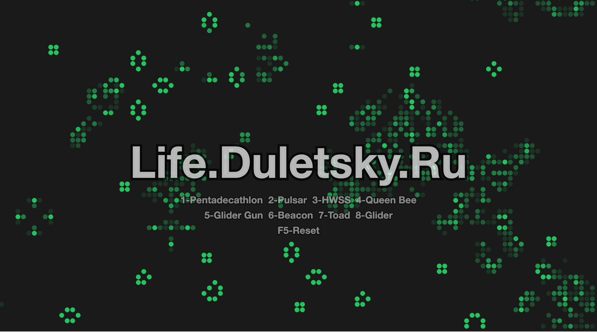

# Conway's Game of Life 🧬

Интерактивная реализация игры "Жизнь" Конвея на чистом HTML5 Canvas и JavaScript. Идея - https://www.jetbrains.com/junie/ 



## ✨ Особенности

- 🎯 **Один HTML файл** - никаких зависимостей, работает везде
- 🔄 **Круглые клетки** с плавными переходами появления/исчезновения
- 🌀 **Спиральное расположение** групп от центра экрана
- 📱 **Адаптивный дизайн** - автоматически подстраивается под размер экрана
- ⚡ **Высокая производительность** с поддержкой Retina дисплеев
- 🎨 **Рыхлые группы** - органичное начальное расположение клеток

## 🚀 Запуск

Просто откройте файл `index.html` в браузере:

```bash
# В macOS
open index.html

# В Linux
xdg-open index.html

# В Windows
start index.html
```

Или перетащите файл в браузер.

## 🎮 Управление

- **Автозапуск** - игра начинается автоматически
- **F5 или Ctrl+R** - сброс и перезапуск
- **Esc** - выход из полноэкранного режима

## 🏗️ Архитектура

### Начальное состояние
- **5 групп** клеток по 100-200 штук каждая
- **Спиральное размещение** групп от центра экрана
- **Рыхлое распределение** клеток внутри групп (не квадратные блоки)

### Визуализация
- **Круглые клетки** размером 8px с промежутками 1px
- **Плавные переходы** появления/исчезновения (альфа-каналы)
- **Зеленый цвет** клеток (#22c55e) на темном фоне
- **Полупрозрачная надпись** по центру экрана

### Производительность
- Поддержка **Retina дисплеев** (device pixel ratio)
- Оптимизированный рендеринг только активных клеток
- Автоматическая адаптация к размеру окна

## 📋 Правила игры "Жизнь"

1. **Выживание**: Живая клетка с 2-3 соседями остается живой
2. **Смерть**: Живая клетка с <2 или >3 соседями умирает
3. **Рождение**: Мертвая клетка с ровно 3 соседями оживает
4. **Тороидальное поле**: края экрана соединены (клетки "обернуты")

## 📁 Структура проекта

```
life-gb/
├── index.html      # Вся игра в одном файле
└── docs/           # Документация проекта
    ├── changelog.md    # История изменений
    ├── tasktracker.md  # Трекер задач
    └── project.md      # Техническая документация
```

## 🛠️ Технологии

- **HTML5 Canvas** - отрисовка и анимация
- **Vanilla JavaScript** - логика (ES6+)
- **CSS3** - стилизация и адаптивность

## 🔧 Настройка

Все настройки находятся в начале JavaScript кода в `index.html`:

```javascript
this.cellSize = 8;     // Размер клеток в пикселях
this.cellGap = 1;      // Промежуток между клетками
this.speed = 10;       // Скорость анимации (кадров в секунду)
```

## 📈 Производительность

- **Размер**: ~15KB HTML файл
- **Загрузка**: мгновенная
- **Потребление памяти**: ~5-10MB
- **FPS**: 60fps на современных устройствах
- **Совместимость**: все браузеры с поддержкой Canvas

## 🎯 Преимущества простоты

- ✅ **Никаких зависимостей** - работает offline
- ✅ **Мгновенный запуск** - просто откройте файл
- ✅ **Легкий деплой** - один файл на любой хостинг
- ✅ **Максимальная совместимость** - работает везде
- ✅ **Простота кода** - легко понять и модифицировать

---

Проект создан как демонстрация того, что красивые интерактивные приложения можно создавать без сложных фреймворков и инструментов сборки. Иногда простота - это лучшее решение! 🎯 
