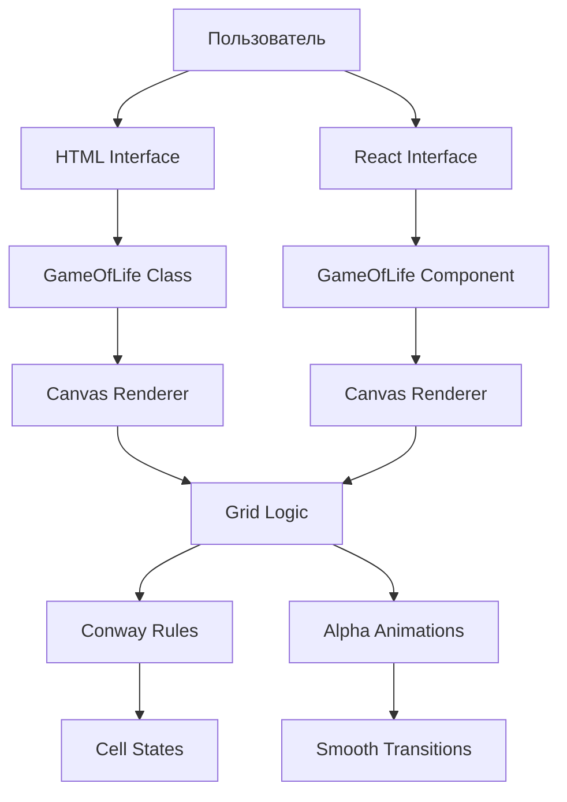

# Архитектура проекта Conway's Game of Life

## Обзор

Проект реализует игру "Жизнь" Конвея в двух вариантах:
1. **HTML-версия** - автономная реализация на ванильном JavaScript
2. **React-версия** - современная TypeScript реализация с Vite

## Архитектурная диаграмма



## Компоненты системы

### 1. HTML-версия (game-of-life.html)

#### GameOfLife Class
**Файл:** `game-of-life.html` (встроенный скрипт)

**Ответственность:**
- Управление состоянием игры
- Рендеринг на Canvas
- Обработка пользовательского ввода
- Анимационный цикл

**Основные методы:**
```javascript
class GameOfLife {
  init()                    // Инициализация игры
  resizeCanvas()           // Адаптация под размер экрана
  initializeGrid()         // Создание случайных кластеров
  countNeighbors(x, y)     // Подсчет соседей клетки
  update()                 // Применение правил Конвея
  render()                 // Отрисовка кадра
  animate(timestamp)       // Анимационный цикл
}
```

### 2. React-версия

#### GameOfLife Component
**Файл:** `src/components/GameOfLife.tsx`

**Ответственность:**
- React hooks для управления состоянием
- Жизненный цикл компонента
- Обработка событий браузера

**Хуки состояния:**
```typescript
const [isRunning, setIsRunning] = useState(false)
const [generation, setGeneration] = useState(0)
const [speed, setSpeed] = useState(10)
const [gridSize, setGridSize] = useState({ rows: 0, cols: 0 })
```

**Ключевые функции:**
```typescript
initializeGrid()          // Создание игрового поля
updateGrid()             // Обновление состояния
renderGrid()             // Рендеринг
animate()                // Анимационный цикл
```

## Структуры данных

### Cell (React-версия)
```typescript
type Cell = {
  alive: boolean      // Текущее состояние
  nextState: boolean  // Следующее состояние
  alpha: number       // Прозрачность для анимации
}
```

### Grid (HTML-версия)
```javascript
this.grid = []        // Двумерный массив boolean
this.alphaGrid = []   // Двумерный массив прозрачностей
```

## Алгоритмы

### Правила Конвея

```javascript
function applyConwayRules(cell, neighbors) {
  if (cell.alive) {
    // Живая клетка выживает с 2 или 3 соседями
    return neighbors === 2 || neighbors === 3
  } else {
    // Мертвая клетка оживает с ровно 3 соседями  
    return neighbors === 3
  }
}
```

### Алгоритм плавных переходов

```javascript
function updateAlpha(cell, fadeSpeed = 0.15) {
  if (cell.shouldBeAlive) {
    // Плавное появление
    cell.alpha = Math.min(1.0, cell.alpha + fadeSpeed)
  } else {
    // Плавное исчезновение
    cell.alpha = Math.max(0.0, cell.alpha - fadeSpeed)
  }
}
```

### Генерация кластеров

```javascript
function generateClusters(rows, cols) {
  const numClusters = 5
  
  for (let i = 0; i < numClusters; i++) {
    const clusterSize = Math.floor(Math.random() * 101) + 100 // 100-200
    const centerX = Math.floor(Math.random() * cols)
    const centerY = Math.floor(Math.random() * rows)
    
    // Распределение в области 21x21
    for (let j = 0; j < clusterSize; j++) {
      const offsetX = Math.floor(Math.random() * 21) - 10
      const offsetY = Math.floor(Math.random() * 21) - 10
      
      const x = (centerX + offsetX + cols) % cols
      const y = (centerY + offsetY + rows) % rows
      
      grid[y][x] = true
    }
  }
}
```

## Оптимизации производительности

### 1. Рендеринг
- Использование `requestAnimationFrame` для плавной анимации
- Учет `devicePixelRatio` для четкости на Retina дисплеях
- Рендеринг только видимых клеток с `alpha > 0`

### 2. Вычисления
- Предварительный расчет размеров сетки
- Кэширование размеров canvas
- Оптимизированный подсчет соседей с wrap-around

### 3. Память
- Переиспользование массивов состояний
- Минимальное количество объектов в памяти
- Cleanup анимационных таймеров

## Паттерны проектирования

### 1. Singleton (HTML-версия)
Класс `GameOfLife` создается только один раз на страницу.

### 2. Observer (React-версия) 
Использование React hooks для реактивности состояния.

### 3. Strategy
Различные стратегии рендеринга для HTML и React версий.

### 4. Command
Обработка пользовательских команд (play, pause, reset).

## Конфигурация

### Настраиваемые параметры:

```javascript
// Размеры клеток
const CELL_SIZE = 8        // HTML: 8px, React: 12px  
const CELL_GAP = 1         // Промежуток между клетками

// Анимация
const fadeSpeed = 0.15     // Скорость плавных переходов
const speed = 10           // FPS симуляции

// Популяция
const numClusters = 5      // Количество групп
const clusterSize = 100-200 // Размер группы
```

## Расширяемость

### Добавление новых функций:

1. **Новые правила клеточных автоматов**
   - Модификация функции `countNeighbors`
   - Изменение логики в `update`

2. **Дополнительные эффекты**
   - Расширение системы альфа-каналов
   - Добавление цветовых переходов

3. **Интерактивность**
   - Рисование мышью
   - Загрузка паттернов
   - Сохранение состояний

## Тестирование

### Рекомендуемые тесты:

1. **Unit тесты**
   - Правила Конвея
   - Подсчет соседей
   - Генерация кластеров

2. **Integration тесты**
   - Цикл анимации
   - Управление состоянием
   - Рендеринг

3. **Performance тесты**
   - FPS на больших сетках
   - Потребление памяти
   - Время инициализации

## Совместимость

### Поддерживаемые браузеры:
- Chrome 60+
- Firefox 55+
- Safari 12+
- Edge 79+

### Требования:
- Canvas API support
- ES6+ features
- requestAnimationFrame 